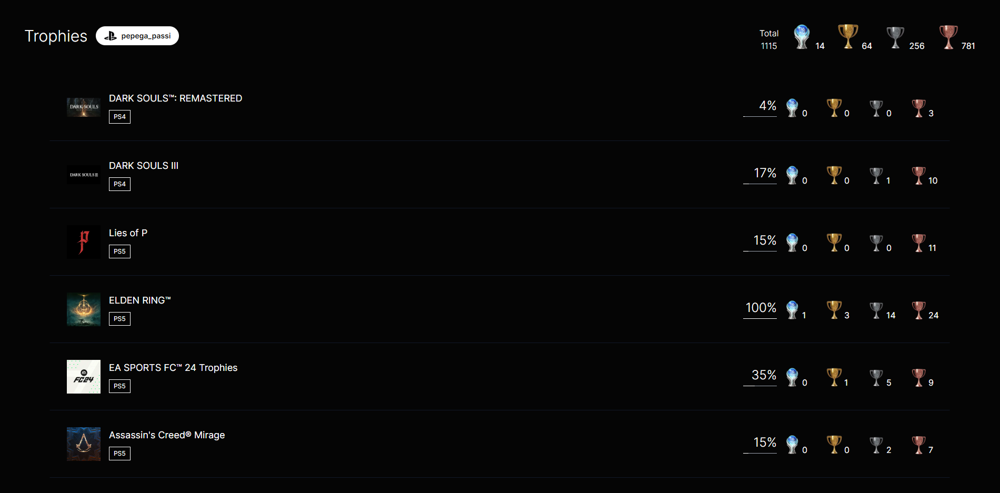
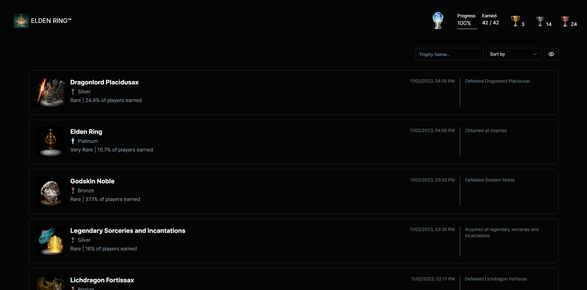

# Trophy Sync

Trophy Sync is a Next.js application that allows you to search for PSN users and display their PSN trophies.

## Screenshots





## Installation

Before running Trophy Sync locally, make sure Node.js and npm are installed on your system.

1. Clone the repository:

```bash
git clone https://github.com/your-username/trophy-sync.git
```

2. Change to the directory:

```bash
cd trophy-sync
```

3. Create an .env file in the root of the project with the following content:

```makefile
NEXT_PUBLIC_SERVER_URL = http://localhost:PORT/
```

Make sure to run the [backend](https://github.com/pascalgrim/trophy-sync-backend) first and include the PORT here.

4. Install dependencies:

```bash
npm install
```

The application is now available at http://localhost:3000.
